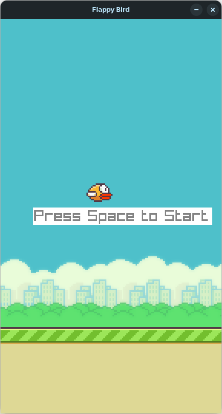
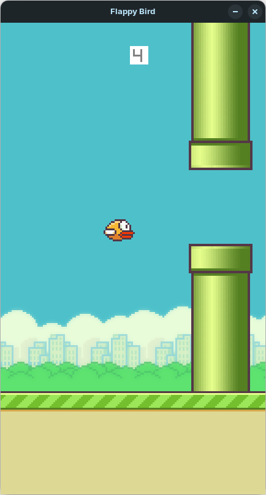
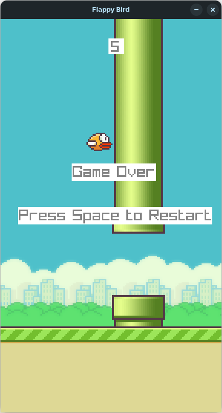

# Flappy Bird Clone

This Flappy Bird Clone was made as our First Semester Project in Bachelors of Science in Artificial Intelligence from **MUET** (Mehran University of Engineering and Technology), Jamshoro.

### Screenshots

*Screenshot of the Starting Screen*

*Screenshot of the Gameplay Screen*

*Screenshot of the Retry Screen*

### Members
This was made as a group project by,
- [Syed Muhammad Irtaza](https://github.com/syedirtaza10/)
- [Abdul Rehman Rajput](https://github.com/abdul-rehman-rajput/)
- [Khalil Shaikh](https://github.com/khalil-oss)
- [Muhammad Ishaque Junejo](https://github.com/IshaqJunejo/)
- Masab Memon
- [Hammad Arain](https://github.com/Hammad-18-03/)

### External Resources

[Raylib](https://github.com/raysan5/raylib) has been used as an external library in this project for handling Game Graphics and User Inputs.
